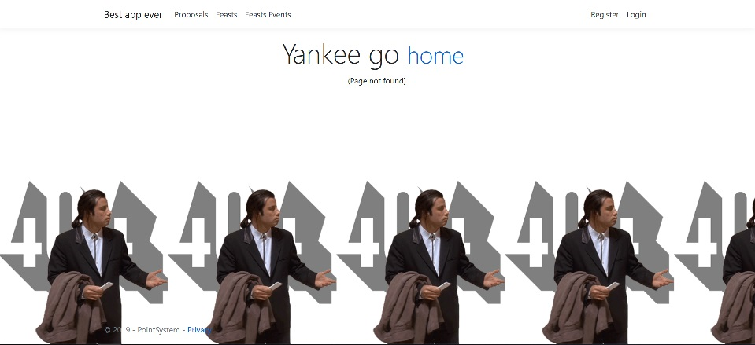
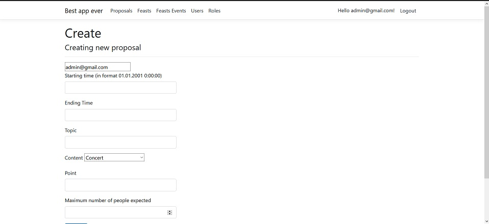
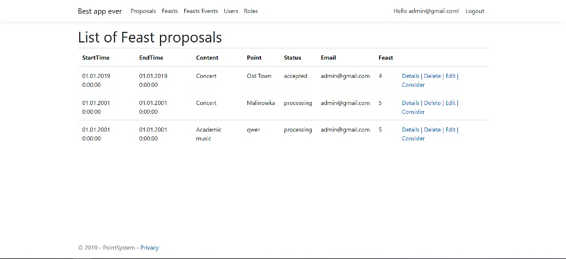
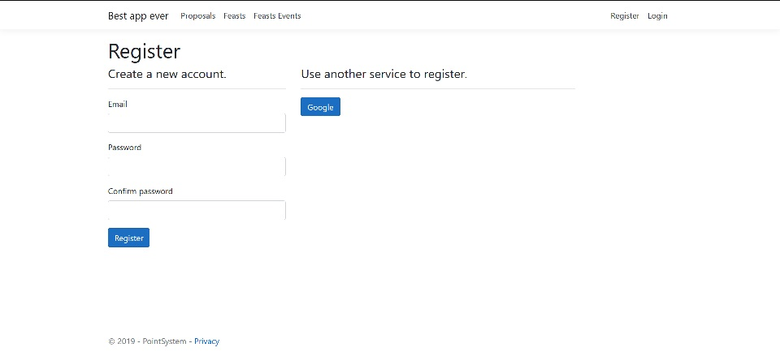

# Basic info
This is ASP.NET Core project written with netcoreapp3.0 as Target Framework.
Site provide an oppertinity to manage city events of three types: **proposals, feast** and **feast events**. **Feast** can be created only by **administration**. Other users are able to create their own **proposals** or became a feast particapents with creating **feast event**. 

Administrators can manage users proposals by accepting or declying them. 

**If you'd like to lauch tis application, you have to change gmail and password in following code in _Models\EmailService.cs_ into your own gmail**

```
await client.AuthenticateAsync("mail", "password");
```

# Feature of this project
* All data is stored with a DB
* SignalR usage - users writing comments on other users Proposals
* Authorization, authentication, user and role managementii
* Sending emails (to prove your mail, comments nontification)
* Logs
* google as 3rd party auth providers 
* Background jobs with Hangfire - mail will be send as reminder of your event
* Custom Error Pages (like that)


## a few more screenshots
proposal_creation


list of proposals


registration



